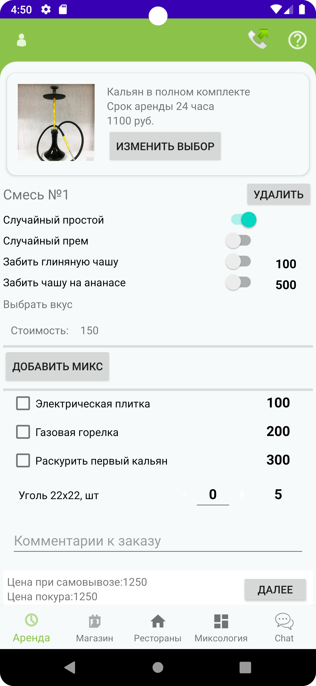
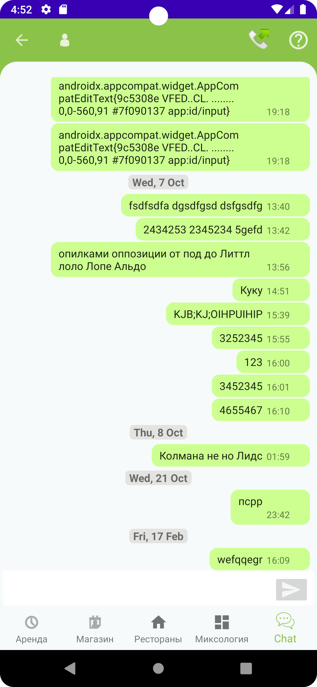

# Android приложение для аренды и доставки кальянов

## Задачи

В данном проекте стояла задача реализовать следующий функционал:
- Создание пользователей
- формирвание заказа аренды кальяна (пункт меню "Аренда" - частичная реализация)
  - выбор комплекта
  - добавление миксов
  - выбор даты и места доставки
- онлайн заказ табака и др. (пункт меню "Магазин" - частичная реализация)
- возможность оформить заказ кальяна находясь в заведении без приглашения официанта (пункт меню "Рестораны" - не реализовано)
- сформировать базу миксов табака (пункт меню "Миксология" - не реализовано)
  - возможность добавления пользователем своего микса
  - комментирование микса
  - оценка микса
  - добавить профили производителей и продавать им места в рекомендациях миксов
- чат (пункт меню "Chat" - частичная реализация)
  - с оператором доставки
  - с производителями табака

## Технические моменты

В работе использовались 
- Firebase Authentication
- Firebase Cloud Firestore
- Firebase Storage

## Дизайн и функции
[скачать apk файл](readme/allsmokeme.apk)

